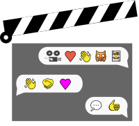

    
    
Movie Talk

 
 

## Description
Movie Talk is a simple Android app that allows you to chat with movie and cartoon heroes, powered by the [OpenAI API](https://platform.openai.com/).

## Example

# Getting Started 
1. Setup the `.env` file based on `.env.example`.
2. Install dependencies with `yarn install`.
3. Run the project using `yarn start`.
